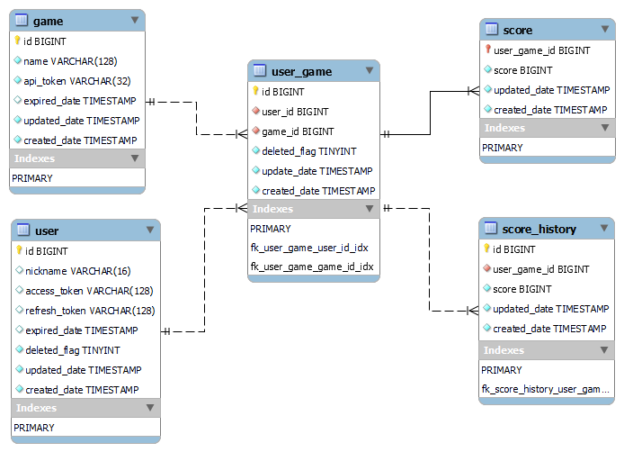

# seg-server
Super Easy Game Server

## Test your scripts before you commit

### PHPMD

https://phpmd.org/

```
docker-compose exec php-app /var/www/src/phpmd.sh
```

### PHPCS

https://github.com/squizlabs/PHP_CodeSniffer

```
docker-compose exec php-app /var/www/src/phpmc.sh
```


---
English

## Specs

1. Issue game ID and API Key
    - API Key has expiration but able to ignore.
    - These mean access token and refresh token.
2. Issue user auth token and user ID
    - User auth token has expiration.
3. Can register nickname or automatically generate it.
4. Resister play result.
    - Play result includes user ID and score.
    - Score will be recorded on each API request and will be able to be added to summerized score on each API request.
5. User can delete its own information and register angain.
6. Score will be shown as ranking super simple and realtime sorted.
    - This will be show as web page.
    - Clicking each score shows the details, for example user ID, nickname, score, history and the latest access date.

## Database definitions



### `game`

|Name|Data Type|Options|
|:---|:---|:---|
|`id`|`BIGINT`|AUTO INCREMENT|
|`name`|`VARCHAR`|NULLABLE|
|`api_token`|`VARCHAR`|NULLABLE|
|`expired_date`|`TIMESTAMP`|NULLABLE|
|`updated_date`|`TIMESTAMP`|ON UPDATE|
|`created_date`|`TIMESTAMP`||

### `user`

|Name|Data Type|Options|
|:---|:---|:---|
|`id`|`BIGINT`|AUTO INCREMENT|
|`nickname`|`VARCHAR`|NULLABLE|
|`access_token`|`VARCHAR`|NULLABLE|
|`refresh_token`|`VARCHAR`|NULLABLE|
|`expired_date`|`TIMESTAMP`|NULLABLE|
|`deleted_flag`|`TINYINT`||
|`updated_date`|`TIMESTAMP`||
|`created_date`|`TIMESTAMP`||

### `user_game`

|Name|Data Type|Options|
|:---|:---|:---|
|`id`|`BIGINT`|AUTO INCREMENT|
|`user_id`|`BIGINT`||
|`game_id`|`BIGINT`||
|`deleted_flag`|`TINYINT`||
|`updated_date`|`TIMESTAMP`||
|`created_date`|`TIMESTAMP`||

### `score`

|Name|Data Type|Options|
|:---|:---|:---|
|`user_game_id`|`BIGINT`||
|`score`|`BIGINT`||
|`updated_date`|`TIMESTAMP`||
|`created_date`|`TIMESTAMP`||

### `score_history`

|Name|Data Type|Options|
|:---|:---|:---|
|`id`|`BIGINT`|AUTO INCREMENT|
|`user_game_id`|`BIGINT`||
|`score`|`BIGINT`||
|`updated_date`|`TIMESTAMP`||
|`created_date`|`TIMESTAMP`||

## Endpoints

### API

|API|Explanation|
|:---|:---|
|`GET /api/auth`|Returns authorized or not.|
|`POST /api/user`|Register user information. API token required.|
|`PUT /api/user`|Update user information. API token required.|
|`POST /api/result`|Register score. API token required.|

### WEB

|API|Explanation|
|:---|:---|
|`/admin/game`|List games.|
|`/admin/game/{game_id}`|Register and update game and generate tokens. When `{game_id}` is undefined, newly registration mode.|
|`/admin/user`|Lists users.|
|`/admin/user/{user_id}`|Shows user details. `{user_id}` is required.|
|`/page`|Portal page for end users.|
|`/page/game/{game_id}`|Game detail page.|
|`/page/game/{game_id}/ranking`|Ranking for game.|
|`/page/user/{user_id}`|User page.|
|`/page/user/{user_id}/history/{game_id}`|User game page.|


---
日本語

## 仕様

1. ゲームIDとAPIキーの発行。
    - APIキーは有効期限を持っているが、これを無視する子もできる。
    - これらはアクセストークン、リフレッシュトークンのことである。
2. ユーザー認証トークンとユーザーIDを発行する。
    - ユーザー認証トークンは有効期限を持っている。
3. ニックネームが登録可能。また自動生成も可能。
4. プレイ結果を登録可能。
    - プレイ結果にはユーザーIDとスコアが含まれる。
    - スコアは各APIリクエストで記録され、合計スコアに加算することもできる。
5. ユーザーはその情報を削除することができ、再登録することができる。
6. スコアは超シンプルなランキングとして表示され、リアルタイムにソートされる。
    - ウェブページとして表示される。
    - 各スコアをクリックすると詳細を表示する。ユーザーID、ニックネーム、スコア、履歴、最終アクセス日。

## Database definitions


### `game`

|Name|Data Type|Options|
|:---|:---|:---|
|`id`|`BIGINT`|AUTO INCREMENT|
|`name`|`VARCHAR`||
|`api_token`|`VARCHAR`|NULLABLE|
|`expired_date`|`TIMESTAMP`|NULLABLE|
|`updated_date`|`TIMESTAMP`|ON UPDATE|
|`created_date`|`TIMESTAMP`||

### `user`

|Name|Data Type|Options|
|:---|:---|:---|
|`id`|`BIGINT`|AUTO INCREMENT|
|`nickname`|`VARCHAR`|NULLABLE|
|`access_token`|`VARCHAR`|NULLABLE|
|`refresh_token`|`VARCHAR`|NULLABLE|
|`expired_date`|`TIMESTAMP`|NULLABLE|
|`deleted_flag`|`TINYINT`||
|`updated_date`|`TIMESTAMP`||
|`created_date`|`TIMESTAMP`||

### `user_game`

|Name|Data Type|Options|
|:---|:---|:---|
|`id`|`BIGINT`|AUTO INCREMENT|
|`user_id`|`BIGINT`||
|`game_id`|`BIGINT`||
|`deleted_flag`|`TINYINT`||
|`updated_date`|`TIMESTAMP`||
|`created_date`|`TIMESTAMP`||

### `score`

|Name|Data Type|Options|
|:---|:---|:---|
|`user_game_id`|`BIGINT`||
|`score`|`BIGINT`||
|`updated_date`|`TIMESTAMP`||
|`created_date`|`TIMESTAMP`||

### `score_history`

|Name|Data Type|Options|
|:---|:---|:---|
|`id`|`BIGINT`|AUTO INCREMENT|
|`user_game_id`|`BIGINT`||
|`score`|`BIGINT`||
|`updated_date`|`TIMESTAMP`||
|`created_date`|`TIMESTAMP`||

## Endpoints

### API

|API|Explanation|
|:---|:---|
|`GET /api/auth`|認証されたかどうか。|
|`POST /api/user`|ユーザー情報の登録。APIトークンは必須。|
|`PUT /api/user`|ユーザー情報の更新。APIトークンは必須。|
|`POST /api/result`|スコア登録。APIトークンは必須。|

### WEB

|API|Explanation|
|:---|:---|
|`/admin/game`|【管理】ゲーム一覧。|
|`/admin/game/{game_id}`|【管理】ゲームを登録、更新し、トークンを生成する。`{game_id}`が未定義の場合、新規登録モード。|
|`/admin/user`|【管理】ユーザー一覧。|
|`/admin/user/{user_id?}`|【管理】詳細を表示する。`{user_id}`は必須。|
|`/page`|エンドユーザー向けのポータルページ。|
|`/page/game/{game_id}`|ゲーム詳細ページ。|
|`/page/game/{game_id}/ranking`|ゲームのランキング。|
|`/page/user/{user_id}`|ユーザーページ。|
|`/page/user/{user_id}/history/{game_id}`|ユーザーゲームページ。|


